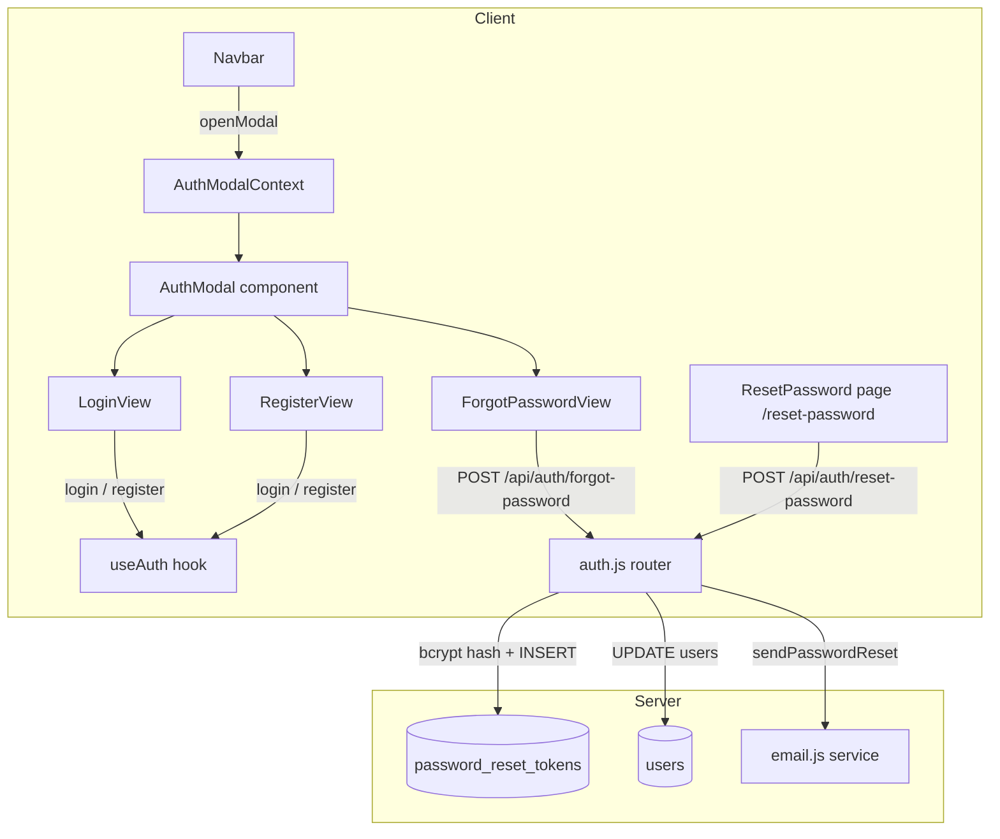

# Design Document: auth-modal

## Overview

The auth-modal feature replaces the standalone `/login` and `/register` pages with a unified modal overlay component. Authentication is triggered in-place from the Navbar, keeping users on their current page. The feature also introduces a complete Forgot Password / Reset Password flow: a new modal view collects the user's email, the backend generates a secure single-use token and sends a reset email, and a new `/reset-password` page lets the user set a new password via the tokenised link.

### Key Design Decisions

- **Single component, internal view state**: `AuthModal` manages a `view` state of `'login' | 'register' | 'forgot-password'` rather than mounting separate components per route.
- **Context-driven open/close**: A new `useAuthModal` context exposes `openModal(view)` and `closeModal()` so any component (Navbar, ProtectedRoute, etc.) can trigger the modal without prop drilling.
- **Backward-compatible routes**: `/login` and `/register` routes are kept but redirect to `/` so existing bookmarks and external links do not 404.
- **Token security**: Raw tokens are never stored; only bcrypt hashes are persisted. A second reset request invalidates the previous token.
- **Accessibility first**: Focus trap, Escape-to-close, `role="dialog"`, `aria-modal`, and `aria-labelledby` are built in from the start.

---

## Architecture



### Data Flow — Forgot Password

1. User clicks "Forgot password?" → modal switches to `ForgotPasswordView`
2. User submits email → `POST /api/auth/forgot-password`
3. Server looks up user, generates `crypto.randomBytes(32)` raw token, bcrypt-hashes it, upserts row in `password_reset_tokens` (deleting any prior unexpired token for that user), sends email with raw token in URL
4. User clicks link → navigates to `/reset-password?token=<raw>`
5. `ResetPassword` page submits `POST /api/auth/reset-password` with `{ token, password }`
6. Server finds candidate rows for the user (by scanning unexpired, unused tokens), bcrypt-compares raw token against each hash, updates `users.password_hash`, sets `token.used_at`

---

## Components and Interfaces

### `AuthModalContext` (`client/src/hooks/useAuthModal.jsx`)

```js
// Context value shape
{
  isOpen: boolean,
  view: 'login' | 'register' | 'forgot-password',
  openModal: (view?: 'login' | 'register' | 'forgot-password') => void,
  closeModal: () => void,
}
```

`AuthModalProvider` wraps the app (inside `AuthProvider`) and renders `<AuthModal />` as a portal sibling to the main layout.

### `AuthModal` (`client/src/components/AuthModal.jsx`)

| Prop | Type | Description |
|------|------|-------------|
| _(none — reads from context)_ | | |

Internal state:
- `view` — current form view (from context)
- `error` — API error string, cleared on view switch
- `loading` — disables submit button during in-flight requests

Renders a `<dialog>`-like overlay via `ReactDOM.createPortal` into `document.body`. Implements:
- Backdrop click → `closeModal()`
- Escape keydown listener → `closeModal()`
- Focus trap via `focusTrap` utility (cycles through all focusable children)
- On open: `useEffect` focuses first focusable element
- On close: restores focus to `triggerRef` (stored in context at `openModal` call time)

ARIA attributes on the container `<div>`:
```html
<div role="dialog" aria-modal="true" aria-labelledby="auth-modal-title">
```

### `LoginView`, `RegisterView`, `ForgotPasswordView`

Sub-components rendered inside `AuthModal`. Each receives:
```js
{
  onSuccess: () => void,       // closes modal + updates auth state
  onSwitchView: (view) => void,
  onError: (msg: string) => void,
  loading: boolean,
  setLoading: (b: boolean) => void,
}
```

Each view has a heading with `id="auth-modal-title"` so `aria-labelledby` always references the active heading.

### `ResetPassword` (`client/src/pages/ResetPassword.jsx`)

Standalone page at `/reset-password`. Reads `?token` from `useSearchParams`. Two states:
- No token → renders error message
- Token present → renders new-password form; on success shows confirmation with a button that calls `openModal('login')`

### Updated `Navbar`

`Link to="/login"` and `Link to="/register"` replaced with `<button onClick={() => openModal('login')}>` and `<button onClick={() => openModal('register')}>`.

### New Backend Endpoints

#### `POST /api/auth/forgot-password`

Request body: `{ email: string }`

Response: always `200 { message: "If that email is registered, a reset link has been sent." }`

Side effects (only when email matches a user):
1. Delete existing unexpired tokens for that user
2. Generate `rawToken = crypto.randomBytes(32).toString('hex')`
3. `tokenHash = await bcrypt.hash(rawToken, 10)`
4. Insert into `password_reset_tokens`
5. Call `sendPasswordReset(user.email, rawToken)`

#### `POST /api/auth/reset-password`

Request body: `{ token: string, password: string }`

Validation: `password.length >= 8`

Logic:
1. Find all unexpired, unused token rows
2. `bcrypt.compare(rawToken, row.token_hash)` for each — O(n) but n is always 1 in practice
3. On match: `UPDATE users SET password_hash = newHash WHERE id = row.user_id`, `UPDATE password_reset_tokens SET used_at = now() WHERE id = row.id`
4. Return `200 { message: "Password updated." }`
5. On no match / expired / used: `400 { error: "..." }`

---

## Data Models

### `password_reset_tokens` table (migration `004_create_password_reset_tokens.sql`)

```sql
CREATE TABLE password_reset_tokens (
  id         UUID PRIMARY KEY DEFAULT gen_random_uuid(),
  user_id    UUID NOT NULL REFERENCES users(id) ON DELETE CASCADE,
  token_hash TEXT NOT NULL,
  expires_at TIMESTAMPTZ NOT NULL,
  used_at    TIMESTAMPTZ
);

CREATE INDEX idx_prt_user_id ON password_reset_tokens(user_id);
```

`expires_at` is set to `NOW() + INTERVAL '1 hour'` at insert time.

A token is considered **valid** when: `used_at IS NULL AND expires_at > NOW()`.

### `useAuthModal` context state

```ts
interface AuthModalState {
  isOpen: boolean;
  view: 'login' | 'register' | 'forgot-password';
  triggerElement: HTMLElement | null; // for focus restoration
}
```

### API request/response schemas (Zod, server-side)

```js
const forgotPasswordSchema = z.object({
  email: z.string().email(),
});

const resetPasswordSchema = z.object({
  token: z.string().min(1),
  password: z.string().min(8, 'Password must be at least 8 characters'),
});
```

---

## Correctness Properties

*A property is a characteristic or behavior that should hold true across all valid executions of a system — essentially, a formal statement about what the system should do. Properties serve as the bridge between human-readable specifications and machine-verifiable correctness guarantees.*

### Property 1: Error messages are cleared on view switch

*For any* Auth_Modal state containing one or more validation or API error messages, switching to a different view (login → register, register → forgot-password, etc.) should result in no error messages being visible in the new view.

**Validates: Requirements 3.3**

---

### Property 2: API error messages are displayed verbatim

*For any* error message string returned by the Auth_API for login or registration, the corresponding view (Login_View or Register_View) should display that exact string to the user.

**Validates: Requirements 4.3, 5.3**

---

### Property 3: Forgot-password always returns 200

*For any* email string (whether or not it corresponds to a registered user), the `POST /api/auth/forgot-password` endpoint should return HTTP 200, never revealing whether the email exists in the system.

**Validates: Requirements 6.4**

---

### Property 4: Reset tokens are stored as bcrypt hashes

*For any* password reset token generated by the system, the value stored in `password_reset_tokens.token_hash` should be a valid bcrypt hash that does not equal the raw token, and `bcrypt.compare(rawToken, storedHash)` should return true.

**Validates: Requirements 7.1**

---

### Property 5: Second reset request invalidates the first

*For any* user who requests two consecutive password resets, after the second request only the second token should be valid (the first token should be absent or marked such that it cannot be used to reset the password).

**Validates: Requirements 7.2**

---

### Property 6: Reset-password enforces minimum password length

*For any* password string with fewer than 8 characters, `POST /api/auth/reset-password` should return HTTP 400 regardless of token validity.

**Validates: Requirements 8.9**

---

### Property 7: Valid token reset updates password and marks token used

*For any* valid (unexpired, unused) reset token and any new password of at least 8 characters, calling `POST /api/auth/reset-password` should update the user's `password_hash` in the `users` table and set `used_at` on the token row, such that the old password no longer authenticates and the token cannot be reused.

**Validates: Requirements 8.4**

---

### Property 8: Reset email contains correctly formatted URL

*For any* raw token value and `CLIENT_URL` configuration, the password reset email generated by `sendPasswordReset` should contain a URL matching `{CLIENT_URL}/reset-password?token={rawToken}` and should mention the 1-hour expiry.

**Validates: Requirements 9.1, 9.2**

---

### Property 9: Focus trap keeps focus within open modal

*For any* number of Tab or Shift+Tab key presses while the Auth_Modal is open, the focused element should always be one of the focusable elements inside the modal container.

**Validates: Requirements 10.2**

---

### Property 10: aria-labelledby references active view heading

*For any* view state of the Auth_Modal (login, register, or forgot-password), the `aria-labelledby` attribute on the modal container should reference the `id` of the heading element that is currently visible.

**Validates: Requirements 10.4**

---

## Error Handling

| Scenario | Behaviour |
|----------|-----------|
| Login API returns 401 | Display API error message in Login_View; keep modal open |
| Register API returns 409 (duplicate email) | Display "Email already in use" in Register_View |
| Forgot-password API error (5xx) | Display generic "Something went wrong. Please try again." in Forgot_Password_View |
| Reset-password with expired token | API returns 400 with message; Reset_Password_Page displays it |
| Reset-password with used token | API returns 400 with message; Reset_Password_Page displays it |
| Reset-password with invalid token | API returns 400; page displays error |
| `/reset-password` loaded without `?token` | Page renders "This reset link is invalid or has expired." immediately |
| Network error on any modal form | Catch block sets error state with "Network error. Please check your connection." |
| Submit button double-click | `loading` state disables button immediately on first submission |

---

## Testing Strategy

### Unit Tests (example-based)

Located in `client/src/tests/` and `server/tests/unit/`.

Frontend (Vitest + React Testing Library):
- `AuthModal.test.jsx` — open/close via backdrop, Escape key, close button; focus restoration; ARIA attributes; view switching
- `LoginView.test.jsx` — successful login closes modal and updates auth state; API error displayed; button disabled during request
- `RegisterView.test.jsx` — successful registration closes modal; API error displayed; button disabled during request
- `ForgotPasswordView.test.jsx` — confirmation message shown after submit; button disabled during request
- `ResetPassword.test.jsx` — renders form with token param; renders error without token param; success message after reset
- `Navbar.test.jsx` — Sign In opens login view; Get Started opens register view; buttons hidden when authenticated

Backend (Jest):
- `auth.test.js` additions — forgot-password returns 200 for unknown email; reset-password rejects short passwords; reset-password rejects expired/used tokens

### Property-Based Tests

Using **fast-check** (already a natural fit for the Node.js/Vitest stack).

Located in `server/tests/property/auth.property.js` (extend existing file) and `client/src/tests/auth-modal.property.jsx`.

Each property test runs a minimum of **100 iterations**.

| Property | Test file | fast-check arbitraries |
|----------|-----------|------------------------|
| P1: Error cleared on view switch | `auth-modal.property.jsx` | `fc.string()` for error message, `fc.constantFrom('login','register','forgot-password')` for views |
| P2: API error displayed verbatim | `auth-modal.property.jsx` | `fc.string({ minLength: 1 })` for error message |
| P3: Forgot-password always 200 | `auth.property.js` | `fc.emailAddress()` for email |
| P4: Tokens stored as bcrypt hashes | `auth.property.js` | `fc.hexaString({ minLength: 64, maxLength: 64 })` for raw token |
| P5: Second reset invalidates first | `auth.property.js` | `fc.record({ email: fc.emailAddress() })` for user |
| P6: Reset enforces min password length | `auth.property.js` | `fc.string({ maxLength: 7 })` for short password |
| P7: Valid token reset updates password | `auth.property.js` | `fc.string({ minLength: 8 })` for new password |
| P8: Reset email URL format | `auth.property.js` | `fc.hexaString({ minLength: 64 })` for token, `fc.webUrl()` for CLIENT_URL |
| P9: Focus trap | `auth-modal.property.jsx` | `fc.integer({ min: 1, max: 50 })` for tab press count |
| P10: aria-labelledby matches active view | `auth-modal.property.jsx` | `fc.constantFrom('login','register','forgot-password')` for view |

Tag format for each property test:
```js
// Feature: auth-modal, Property N: <property text>
```

### Integration Tests

- `server/tests/integration/auth-flow.test.js` — end-to-end: register → forgot-password → reset-password → login with new password
- Verify `password_reset_tokens` table schema after migration

### Accessibility Testing

- Manual testing with VoiceOver/NVDA to verify focus trap and screen reader announcements
- Automated axe-core scan via `@axe-core/react` in development mode
