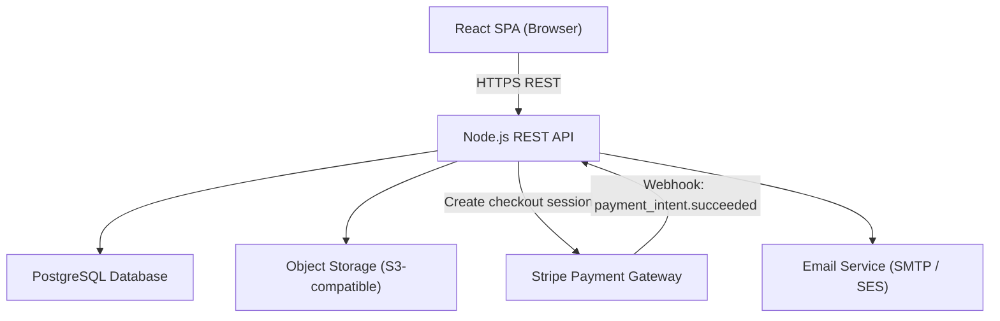
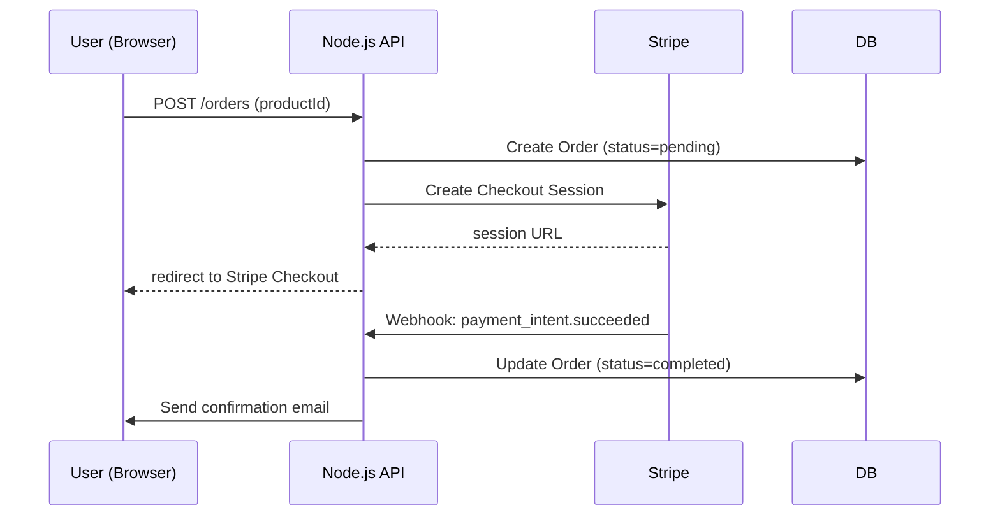
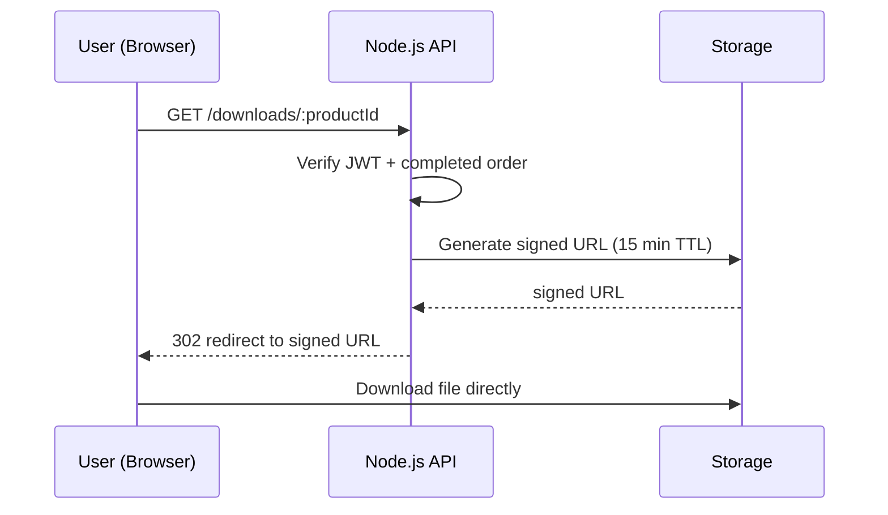

# Design Document: Digital Marketplace

## Overview

The digital marketplace is a full-stack web application where creators sell digital products (source code, plugins, themes, scripts) and buyers browse, purchase, and download them. An admin dashboard provides product management and sales analytics.

The system is split into a React JS single-page application (frontend) and a Node.js REST API (backend). Authentication is JWT-based. Payments are handled via Stripe. File storage uses a cloud object store (e.g., AWS S3 or compatible). The backend is structured as a set of logical services (Auth, Product, Order, Download) that can be deployed as a monolith or decomposed later.

### Key Design Goals

- Secure by default: JWT in HTTP-only cookies, bcrypt password hashing, signed time-limited download URLs
- Clean separation of concerns: each service owns its domain
- Stripe webhook-driven order completion to avoid race conditions
- Role-based access control enforced at the middleware layer

---

## Architecture



### Request Flow — Purchase



### Request Flow — Download



---

## Components and Interfaces

### Backend Services

#### Auth Service (`/api/auth`)

| Method | Path | Description |
|--------|------|-------------|
| POST | `/api/auth/register` | Register new user |
| POST | `/api/auth/login` | Login, returns JWT in HTTP-only cookie |
| POST | `/api/auth/logout` | Clear auth cookie |

Middleware:
- `authenticate` — verifies JWT from cookie or Authorization header, attaches `req.user`
- `requireAdmin` — checks `req.user.role === 'admin'`, returns 403 otherwise

#### Product Service (`/api/products`)

| Method | Path | Auth | Description |
|--------|------|------|-------------|
| GET | `/api/products` | Public | Paginated product list with search/filter |
| GET | `/api/products/:id` | Public | Product detail |
| POST | `/api/products` | Admin | Create product + upload file |
| PUT | `/api/products/:id` | Admin | Update product details |
| DELETE | `/api/products/:id` | Admin | Soft-delete (unpublish) product |

#### Order Service (`/api/orders`)

| Method | Path | Auth | Description |
|--------|------|------|-------------|
| POST | `/api/orders` | User | Initiate purchase, returns Stripe checkout URL |
| GET | `/api/orders` | User | List user's orders |
| POST | `/api/orders/webhook` | Stripe | Stripe webhook handler (no JWT) |
| GET | `/api/admin/orders` | Admin | List all orders |
| GET | `/api/admin/orders/export` | Admin | Export orders as CSV |

#### Download Service (`/api/downloads`)

| Method | Path | Auth | Description |
|--------|------|------|-------------|
| GET | `/api/downloads/:productId` | User | Generate signed URL for purchased product |

#### Admin Dashboard API (`/api/admin`)

| Method | Path | Auth | Description |
|--------|------|------|-------------|
| GET | `/api/admin/metrics` | Admin | Revenue, order count, user count |

### Frontend Components

```
src/
  pages/
    Home.jsx            # Product listing with search/filter
    ProductDetail.jsx   # Product detail + buy button
    Checkout.jsx        # Stripe redirect handler
    MyDownloads.jsx     # User's purchased products
    Login.jsx
    Register.jsx
    admin/
      Dashboard.jsx     # Sales metrics
      Products.jsx      # Product CRUD
      Orders.jsx        # Order list + CSV export
  components/
    ProductCard.jsx
    SearchBar.jsx
    FilterPanel.jsx
    Pagination.jsx
    DownloadButton.jsx
  hooks/
    useAuth.js          # Auth context + JWT state
    useProducts.js
    useOrders.js
  services/
    api.js              # Axios instance with interceptors
```

---

## Data Models

### User

```sql
CREATE TABLE users (
  id          UUID PRIMARY KEY DEFAULT gen_random_uuid(),
  email       TEXT UNIQUE NOT NULL,
  display_name TEXT NOT NULL,
  password_hash TEXT NOT NULL,          -- bcrypt, cost >= 10
  role        TEXT NOT NULL DEFAULT 'user',  -- 'user' | 'admin'
  created_at  TIMESTAMPTZ NOT NULL DEFAULT now()
);
```

### Product

```sql
CREATE TABLE products (
  id           UUID PRIMARY KEY DEFAULT gen_random_uuid(),
  title        TEXT NOT NULL,
  description  TEXT NOT NULL,
  price_cents  INTEGER NOT NULL,        -- stored in cents (USD)
  category     TEXT NOT NULL,           -- 'theme' | 'plugin' | 'script' | 'source_code'
  preview_link TEXT,                    -- nullable external URL
  file_key     TEXT NOT NULL,           -- object storage key
  file_format  TEXT NOT NULL,           -- 'zip' | 'rar' | 'tar.gz'
  published    BOOLEAN NOT NULL DEFAULT true,
  created_at   TIMESTAMPTZ NOT NULL DEFAULT now(),
  updated_at   TIMESTAMPTZ NOT NULL DEFAULT now()
);
```

### Order

```sql
CREATE TABLE orders (
  id                  UUID PRIMARY KEY DEFAULT gen_random_uuid(),
  user_id             UUID NOT NULL REFERENCES users(id),
  product_id          UUID NOT NULL REFERENCES products(id),
  amount_cents        INTEGER NOT NULL,
  currency            TEXT NOT NULL DEFAULT 'usd',
  status              TEXT NOT NULL DEFAULT 'pending',  -- 'pending' | 'completed' | 'failed'
  stripe_session_id   TEXT UNIQUE,
  stripe_payment_intent TEXT,
  completed_at        TIMESTAMPTZ,
  created_at          TIMESTAMPTZ NOT NULL DEFAULT now()
);
```

### JWT Payload

```json
{
  "sub": "<user_id>",
  "email": "<user_email>",
  "role": "user | admin",
  "iat": 1700000000,
  "exp": 1700086400
}
```

### Signed Download URL

Generated by the object storage SDK (e.g., `getSignedUrl` from AWS S3). The URL encodes:
- Object key (product file)
- Expiry: `now + 15 minutes`
- Signature: HMAC using storage credentials

No additional database record is needed — the signature itself is the proof of authorization.

---

## Correctness Properties

*A property is a characteristic or behavior that should hold true across all valid executions of a system — essentially, a formal statement about what the system should do. Properties serve as the bridge between human-readable specifications and machine-verifiable correctness guarantees.*

### Property 1: Registration input validation

*For any* registration payload, the Auth_Service SHALL accept the request if and only if the email is a valid unique email address and the password is at least 8 characters long. Any payload failing either condition SHALL be rejected with the appropriate 4xx error.

**Validates: Requirements 1.1, 1.4**

---

### Property 2: Registration returns a valid JWT

*For any* valid registration payload (unique email, display name, password >= 8 chars), the Auth_Service SHALL return a structurally valid signed JWT token.

**Validates: Requirements 1.2**

---

### Property 3: Login JWT has 24-hour expiry

*For any* registered user, when a login request is made with the correct credentials, the returned JWT SHALL have an expiry exactly 24 hours (86400 seconds) after its issued-at time.

**Validates: Requirements 2.1**

---

### Property 4: Invalid login credentials return 401

*For any* login request where the email is not registered or the password does not match the stored hash, the Auth_Service SHALL return a 401 Unauthorized error.

**Validates: Requirements 2.2**

---

### Property 5: Product search and filter correctness

*For any* set of published products and any search query or category filter, all products returned by the Product_Service SHALL satisfy the filter condition (title/description contains the query string, or category matches the filter), and no product satisfying the condition SHALL be omitted from the results.

**Validates: Requirements 3.2, 3.3**

---

### Property 6: Product detail response contains all required fields

*For any* published product (with or without a preview_link), the product detail response SHALL contain title, description, price, category, and preview_link (null if not set).

**Validates: Requirements 3.4**

---

### Property 7: Webhook order completion

*For any* pending order, when the Stripe webhook delivers a `payment_intent.succeeded` event for that order's session, the Order_Service SHALL transition the order status to `completed`.

**Validates: Requirements 4.2**

---

### Property 8: Download URL has 15-minute TTL

*For any* user with a completed order for a product, the signed download URL generated by the Download_Service SHALL have an expiry of exactly 15 minutes from the time of generation.

**Validates: Requirements 5.1**

---

### Property 9: Unauthorized download returns 403

*For any* user and any product for which that user does not have a completed order, a request to the Download_Service SHALL return a 403 Forbidden error.

**Validates: Requirements 5.2**

---

### Property 10: My Downloads lists all purchased products

*For any* user with N completed orders, the user's order/download listing SHALL contain exactly those N products and no others.

**Validates: Requirements 5.5**

---

### Property 11: Product creation persists all fields

*For any* valid product creation payload submitted by an admin, the Product_Service SHALL create a product record containing all submitted fields and store the uploaded file, such that a subsequent GET for that product returns the same field values.

**Validates: Requirements 6.1**

---

### Property 12: Product update round-trip

*For any* existing product and any valid update payload, after a PUT request the Product_Service SHALL persist the changes such that a subsequent GET returns the updated values.

**Validates: Requirements 6.3**

---

### Property 13: Soft-delete removes product from public listing

*For any* published product, after an admin deletes it, the product SHALL NOT appear in the public product listing (GET /api/products).

**Validates: Requirements 6.4**

---

### Property 14: File format validation

*For any* product file upload, the Product_Service SHALL accept files with ZIP, RAR, or TAR.GZ extensions and reject files with any other format.

**Validates: Requirements 6.6**

---

### Property 15: Admin metrics are arithmetically correct

*For any* set of completed orders and registered users, the metrics endpoint SHALL return total_revenue equal to the sum of all completed order amounts, completed_orders equal to the count of completed orders, and registered_users equal to the count of users.

**Validates: Requirements 7.2**

---

### Property 16: Date range filter returns only in-range orders

*For any* date range filter applied to the admin orders endpoint, all returned orders SHALL have a `completed_at` timestamp within the specified range, and no in-range order SHALL be excluded.

**Validates: Requirements 7.3**

---

### Property 17: CSV export contains all orders with correct fields

*For any* set of orders in the system, the CSV export SHALL contain one row per order, and each row SHALL include order ID, buyer email, product title, amount paid, and order status.

**Validates: Requirements 7.1, 7.4**

---

### Property 18: Role-based access control

*For any* request to an admin endpoint made by a non-admin user (including unauthenticated requests), the Auth_Service SHALL return a 403 Forbidden error. *For any* request to a protected user endpoint made without a valid JWT token, the Auth_Service SHALL return a 401 Unauthorized error.

**Validates: Requirements 8.1, 8.2, 8.3, 8.4**

---

## Error Handling

### Authentication Errors

| Scenario | HTTP Status | Response |
|----------|-------------|----------|
| Missing or invalid JWT | 401 | `{ "error": "Unauthorized" }` |
| Expired JWT | 401 | `{ "error": "Token expired" }` |
| Non-admin accessing admin route | 403 | `{ "error": "Forbidden" }` |

### Registration / Login Errors

| Scenario | HTTP Status | Response |
|----------|-------------|----------|
| Email already registered | 409 | `{ "error": "Email already in use" }` |
| Password too short | 400 | `{ "error": "Password must be at least 8 characters" }` |
| Invalid credentials | 401 | `{ "error": "Invalid email or password" }` |

### Product Errors

| Scenario | HTTP Status | Response |
|----------|-------------|----------|
| File exceeds 500 MB | 413 | `{ "error": "File too large" }` |
| Unsupported file format | 415 | `{ "error": "Unsupported file format" }` |
| Product not found | 404 | `{ "error": "Product not found" }` |

### Order / Payment Errors

| Scenario | HTTP Status | Response |
|----------|-------------|----------|
| Payment failed | 402 | `{ "error": "Payment failed" }` |
| Stripe webhook signature invalid | 400 | `{ "error": "Invalid webhook signature" }` |

### Download Errors

| Scenario | HTTP Status | Response |
|----------|-------------|----------|
| No completed order for product | 403 | `{ "error": "Purchase required to download" }` |
| Signed URL expired | 410 | `{ "error": "Download link expired" }` |

### Global Error Handling

- All unhandled errors return `500 Internal Server Error` with a generic message (no stack traces in production)
- Input validation uses a schema validation library (e.g., Zod or Joi) and returns structured 400 errors
- Stripe webhook handler verifies the `Stripe-Signature` header before processing any event

---

## Testing Strategy

### Approach

The testing strategy uses a dual approach:
- **Unit / property-based tests** for pure logic, validation, data transformations, and business rules
- **Integration tests** for database interactions, Stripe webhook handling, and file storage
- **End-to-end tests** (optional, smoke level) for critical user journeys

### Property-Based Testing

PBT applies to this feature because the core services contain pure validation logic, data transformations, and business rules that vary meaningfully with input. The input space (user credentials, product data, order payloads, date ranges) is large enough that randomized testing will surface edge cases that hand-written examples miss.

**Library**: [fast-check](https://github.com/dubzzz/fast-check) (JavaScript/TypeScript)

**Configuration**: Each property test runs a minimum of **100 iterations**.

**Tag format**: Each property test must include a comment:
```
// Feature: digital-marketplace, Property N: <property_text>
```

**Properties to implement** (one property-based test per property):

| Property | Test focus |
|----------|-----------|
| P1: Registration input validation | Generate random (email, password) pairs; verify accept/reject matches validity rules |
| P2: Registration returns valid JWT | Generate valid credentials; verify JWT structure |
| P3: Login JWT 24h expiry | Register + login with random credentials; verify exp - iat = 86400 |
| P4: Invalid login returns 401 | Generate unregistered credentials; verify 401 |
| P5: Search/filter correctness | Generate random product sets + queries; verify result set correctness |
| P6: Product detail fields | Generate random products; verify all required fields present |
| P7: Webhook order completion | Generate pending orders + webhook events; verify status transition |
| P8: Download URL TTL | Generate completed orders; verify signed URL expiry = now + 15min |
| P9: Unauthorized download 403 | Generate users without orders; verify 403 |
| P10: My Downloads completeness | Generate users with N orders; verify listing contains exactly N products |
| P11: Product creation round-trip | Generate random product payloads; verify GET returns same values |
| P12: Product update round-trip | Generate random updates; verify GET returns updated values |
| P13: Soft-delete removes from listing | Generate products; delete; verify absent from GET /products |
| P14: File format validation | Generate filenames with valid/invalid extensions; verify accept/reject |
| P15: Metrics arithmetic | Generate random order sets; verify metrics sum correctly |
| P16: Date range filter | Generate orders with varying timestamps; verify filter correctness |
| P17: CSV export completeness | Generate random orders; verify CSV row count and field values |
| P18: RBAC enforcement | Generate non-admin users + admin endpoints; verify 403/401 |

### Unit Tests

Focus on specific examples and edge cases not covered by property tests:

- Password bcrypt hash has cost factor >= 10 (1.5)
- HTTP-only cookie is set on login response (2.3)
- Expired JWT returns 401 (2.4)
- Stripe checkout session is created on order initiation (4.1)
- Confirmation email is sent on order completion (4.5)
- File > 500 MB returns 413 (6.5)
- Preview_Link is attached to product (6.2)
- Preview_Link renders with `target="_blank"` (3.5)

### Integration Tests

- Full registration → login → purchase → download flow
- Stripe webhook end-to-end with test mode keys
- Admin product CRUD with real file upload to test storage bucket
- CSV export with real DB data

### Test Structure

```
tests/
  unit/
    auth.test.js        # Registration, login validation
    product.test.js     # Product CRUD, file format validation
    order.test.js       # Order creation, webhook handling
    download.test.js    # Signed URL generation, authorization
    admin.test.js       # Metrics, CSV export, RBAC
  property/
    auth.property.js    # P1–P4
    product.property.js # P5–P6, P11–P14
    order.property.js   # P7, P15–P17
    download.property.js # P8–P10
    rbac.property.js    # P18
  integration/
    purchase-flow.test.js
    admin-flow.test.js
```
