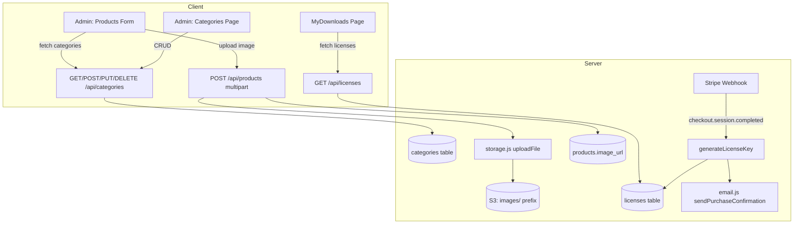
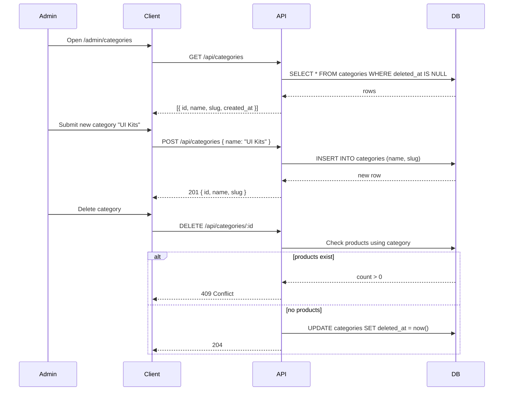
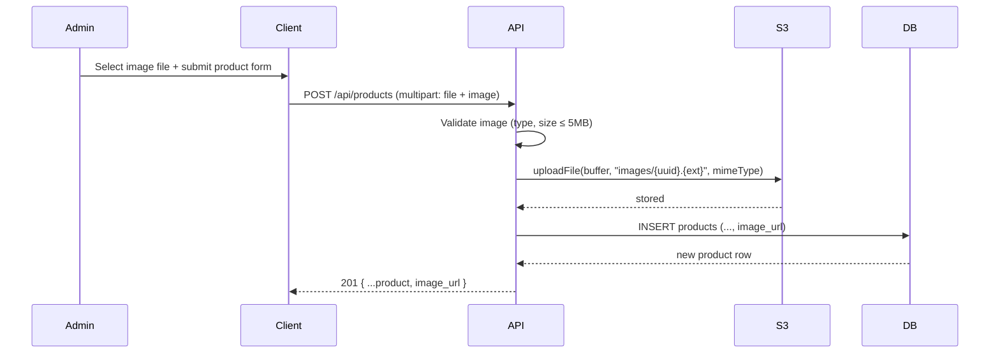
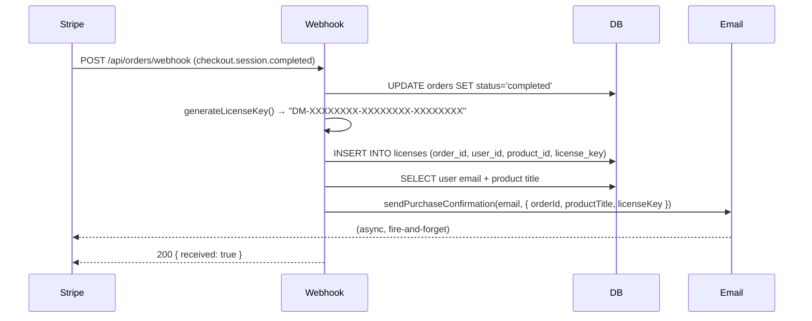

# Design Document: Product Enhancements

## Overview

This feature adds three enhancements to the digital-marketplace: dynamic category management (replacing hardcoded enums with a DB-driven `categories` table), product image upload (thumbnail stored in S3 under `images/` prefix), and license key generation (auto-generated on order completion, stored in a `licenses` table, surfaced in MyDownloads and confirmation emails).

The existing stack is Node.js/Express + PostgreSQL + React/Vite + S3 + Stripe webhooks. All three enhancements are additive — no existing tables are dropped, and the product `category` column remains a `TEXT` field (already unconstrained in the DB).

---

## Architecture



---

## Sequence Diagrams

### Category CRUD



### Product Image Upload



### License Key Generation



---

## Components and Interfaces

### 1. Categories API (`/api/categories`)

**Purpose**: CRUD for admin-managed product categories.

**Interface**:
```typescript
GET    /api/categories          → Category[]          // public, used by product form
POST   /api/categories          → Category            // admin only
PUT    /api/categories/:id      → Category            // admin only
DELETE /api/categories/:id      → 204 | 409           // admin only; 409 if products exist
```

**Category shape**:
```typescript
interface Category {
  id: string        // UUID
  name: string      // e.g. "UI Kits"
  slug: string      // e.g. "ui_kits" (auto-derived, lowercase, spaces→underscore)
  created_at: string
}
```

**Responsibilities**:
- Auto-derive `slug` from `name` on create (lowercase, trim, replace spaces with `_`)
- Reject duplicate names (case-insensitive)
- Soft-delete only; block deletion if any `products.category` matches the slug

---

### 2. Product Image Upload (extension to `/api/products`)

**Purpose**: Accept an optional `image` file field alongside the existing `file` field.

**Interface**:
```typescript
// POST /api/products — multipart fields
{
  file: File          // required — product archive
  image?: File        // optional — thumbnail (jpg/png/webp, ≤ 5MB)
  title: string
  description: string
  price_cents: number
  category: string
  preview_link?: string
}

// PUT /api/products/:id — multipart fields
{
  image?: File        // optional — replace thumbnail
  // + any product fields
}
```

**S3 key pattern**: `images/{uuid}.{ext}` (ext derived from MIME type)

**Responsibilities**:
- Validate image MIME: `image/jpeg`, `image/png`, `image/webp`
- Validate image size ≤ 5MB (separate multer field limit)
- Store public-accessible URL as `https://{bucket}.s3.{region}.amazonaws.com/images/{uuid}.{ext}` in `products.image_url`
- On edit, replace `image_url` if new image provided (old S3 object left for now — no deletion)

---

### 3. Licenses API (`/api/licenses`)

**Purpose**: Expose license keys for authenticated users.

**Interface**:
```typescript
GET /api/licenses   → License[]   // authenticated user's licenses

interface License {
  id: string
  order_id: string
  user_id: string
  product_id: string
  product_title: string   // joined from products
  license_key: string     // "DM-XXXXXXXX-XXXXXXXX-XXXXXXXX"
  created_at: string
}
```

**Responsibilities**:
- Return only licenses belonging to `req.user.sub`
- Join `products.title` for display

---

### 4. Admin Categories Page (`/admin/categories`)

**Purpose**: UI for managing categories.

**Responsibilities**:
- List all active categories in a table
- Inline form to create a new category
- Edit category name in-place
- Delete with confirmation; show error if category is in use

---

### 5. ProductCard & ProductDetail (updated)

**Purpose**: Display product thumbnail when available.

**Responsibilities**:
- If `product.image_url` is set: render `` in the preview area
- If not set: fall back to existing gradient + icon
- `ProductCard`: replace gradient `div` with conditional `img` or gradient
- `ProductDetail`: replace gradient banner with conditional `img` or gradient

---

## Data Models

### `categories` table

```sql
CREATE TABLE categories (
  id         UUID PRIMARY KEY DEFAULT gen_random_uuid(),
  name       TEXT NOT NULL,
  slug       TEXT NOT NULL UNIQUE,
  deleted_at TIMESTAMPTZ,
  created_at TIMESTAMPTZ NOT NULL DEFAULT now()
);

CREATE UNIQUE INDEX ON categories(lower(name)) WHERE deleted_at IS NULL;
```

### `products` table — migration addendum

```sql
ALTER TABLE products ADD COLUMN image_url TEXT;
```

### `licenses` table

```sql
CREATE TABLE licenses (
  id          UUID PRIMARY KEY DEFAULT gen_random_uuid(),
  order_id    UUID NOT NULL REFERENCES orders(id),
  user_id     UUID NOT NULL REFERENCES users(id),
  product_id  UUID NOT NULL REFERENCES products(id),
  license_key TEXT NOT NULL UNIQUE,
  created_at  TIMESTAMPTZ NOT NULL DEFAULT now()
);

CREATE INDEX ON licenses(user_id);
CREATE INDEX ON licenses(order_id);
```

---

## Key Functions with Formal Specifications

### `generateLicenseKey()`

```javascript
function generateLicenseKey(): string
```

**Preconditions**: None (pure function, uses `crypto.randomBytes`)

**Postconditions**:
- Returns string matching `/^DM-[0-9A-F]{8}-[0-9A-F]{8}-[0-9A-F]{8}$/`
- Each call produces a statistically unique value (128 bits of entropy across 3 segments)

**Algorithm**:
```pascal
FUNCTION generateLicenseKey()
  OUTPUT: key of type String

  seg1 ← crypto.randomBytes(4).toString('hex').toUpperCase()
  seg2 ← crypto.randomBytes(4).toString('hex').toUpperCase()
  seg3 ← crypto.randomBytes(4).toString('hex').toUpperCase()
  RETURN "DM-" + seg1 + "-" + seg2 + "-" + seg3
END FUNCTION
```

---

### `deriveSlug(name)`

```javascript
function deriveSlug(name: string): string
```

**Preconditions**: `name` is a non-empty string

**Postconditions**:
- Returns lowercase string with spaces replaced by `_` and non-alphanumeric chars stripped
- Result is deterministic: same input always yields same slug

**Algorithm**:
```pascal
FUNCTION deriveSlug(name)
  INPUT: name of type String
  OUTPUT: slug of type String

  slug ← name.trim().toLowerCase()
  slug ← slug.replace(/\s+/g, '_')
  slug ← slug.replace(/[^a-z0-9_]/g, '')
  RETURN slug
END FUNCTION
```

---

### Webhook license generation (extension to existing handler)

```pascal
PROCEDURE handleCheckoutCompleted(session)
  INPUT: session — Stripe checkout.session object

  order ← UPDATE orders SET status='completed' WHERE stripe_session_id = session.id RETURNING *

  IF order EXISTS THEN
    key ← generateLicenseKey()

    INSERT INTO licenses (order_id, user_id, product_id, license_key)
    VALUES (order.id, order.user_id, order.product_id, key)

    user    ← SELECT email FROM users WHERE id = order.user_id
    product ← SELECT title FROM products WHERE id = order.product_id

    IF user EXISTS AND product EXISTS THEN
      sendPurchaseConfirmation(user.email, {
        orderId:      order.id,
        productTitle: product.title,
        licenseKey:   key
      })
    END IF
  END IF
END PROCEDURE
```

**Preconditions**:
- `session.id` matches a pending order in the DB
- `licenses.license_key` has a UNIQUE constraint (retry on collision is acceptable but statistically negligible)

**Postconditions**:
- Exactly one license row created per completed order
- Email sent with license key included

---

## Algorithmic Pseudocode

### Category Delete Safety Check

```pascal
PROCEDURE deleteCategory(id)
  INPUT: id — UUID of category

  category ← SELECT * FROM categories WHERE id = id AND deleted_at IS NULL

  IF category IS NULL THEN
    RETURN 404
  END IF

  usageCount ← SELECT COUNT(*) FROM products
                WHERE category = category.slug AND published = true

  IF usageCount > 0 THEN
    RETURN 409 { error: "Category is in use by N products" }
  END IF

  UPDATE categories SET deleted_at = now() WHERE id = id
  RETURN 204
END PROCEDURE
```

### Image Upload Validation

```pascal
PROCEDURE validateImage(file)
  INPUT: file — multer file object (may be undefined)
  OUTPUT: error string or null

  IF file IS undefined THEN
    RETURN null  // image is optional
  END IF

  IF file.mimetype NOT IN ['image/jpeg', 'image/png', 'image/webp'] THEN
    RETURN "Unsupported image format (jpg, png, webp only)"
  END IF

  IF file.size > 5 * 1024 * 1024 THEN
    RETURN "Image too large (max 5MB)"
  END IF

  RETURN null
END PROCEDURE
```

---

## Error Handling

| Scenario | HTTP Status | Response |
|---|---|---|
| Category name already exists | 409 | `{ error: "Category already exists" }` |
| Delete category with active products | 409 | `{ error: "Category is in use by N products" }` |
| Image MIME type invalid | 415 | `{ error: "Unsupported image format" }` |
| Image size > 5MB | 413 | `{ error: "Image too large (max 5MB)" }` |
| License key DB unique violation (collision) | Retry once, then 500 | Internal retry |
| Webhook fires twice (idempotency) | — | Second INSERT ignored (UNIQUE on order_id not enforced — license_key UNIQUE prevents duplicate keys; order status already 'completed' so UPDATE returns 0 rows) |

---

## Testing Strategy

### Unit Testing

- `generateLicenseKey()`: assert format regex, assert uniqueness across N=10000 calls
- `deriveSlug()`: assert known input→output pairs, assert idempotency
- `validateImage()`: assert rejection of wrong MIME, oversized file, acceptance of valid inputs

### Property-Based Testing

**Library**: fast-check (already used in `server/tests/property/`)

- `generateLicenseKey` always matches `/^DM-[0-9A-F]{8}-[0-9A-F]{8}-[0-9A-F]{8}$/`
- `deriveSlug(name)` result contains only `[a-z0-9_]` for any non-empty string input
- `deriveSlug(deriveSlug(name)) === deriveSlug(name)` (idempotent)

### Integration Testing

- POST `/api/categories` → creates row, GET returns it
- DELETE `/api/categories/:id` with product using it → 409
- POST `/api/products` with image → `image_url` set in response
- Stripe webhook simulation → license row created, email called with `licenseKey`
- GET `/api/licenses` → returns only current user's licenses

---

## Security Considerations

- Category CRUD endpoints require `requireAdmin` middleware
- `GET /api/categories` is public (needed for product form and filter panel)
- Image uploads validated server-side (MIME + size); client-side validation is UX-only
- License keys are read-only for users; no endpoint allows creating/modifying them
- `GET /api/licenses` scoped to `req.user.sub` — users cannot access others' keys

## Dependencies

No new npm packages required. Uses existing:
- `multer` — already used for product file upload; extend with `.fields()` for image
- `@aws-sdk/client-s3` — already used in `storage.js`
- `crypto` — Node.js built-in for `randomBytes`
- `fast-check` — already used for property tests
