# Design: Support License System

## Overview

This document covers the technical design for four related enhancements to the devmarket platform:

1. **Dashboard Period Filter** — parameterised date range for admin charts and stat cards
2. **Sidebar Icon Resize** — bump nav icons from `w-4 h-4` to `w-5 h-5`
3. **Duplicate Purchase Prevention** — 409 guard at API + disabled UI state
4. **Support License Feature** — purchasable support add-on, help center, admin ticket management, and user chat view

The stack is Node.js/Express + PostgreSQL on the backend and React/Vite + Tailwind on the frontend. Payments go through Paystack (same pattern as existing orders). Email uses the existing nodemailer service.

---

## Architecture

```mermaid
graph TD
  subgraph Client
    PD[ProductDetail page]
    SP[/support page - Help Center/]
    AS[/admin/support page/]
    DB[/admin Dashboard/]
    AL[AdminLayout sidebar]
  end

  subgraph API
    OA[POST /api/orders]
    SLP[POST /api/support-licenses/purchase]
    SLV[GET /api/support-licenses/verify]
    STA[POST /api/support-tickets]
    STM[GET/POST /api/support-tickets/:id/messages]
    STL[GET /api/support-tickets]
    AST[GET /api/admin/support-tickets]
    ASTM[POST /api/admin/support-tickets/:id/messages]
    ASTC[PATCH /api/admin/support-tickets/:id/close]
    CH[GET /api/admin/charts]
    ME[GET /api/admin/metrics]
    WH[POST /api/orders/webhook]
    SLWH[POST /api/support-licenses/webhook]
  end

  subgraph DB
    products[(products)]
    support_licenses[(support_licenses)]
    tickets[(tickets)]
    ticket_messages[(ticket_messages)]
    orders[(orders)]
  end

  PD --> OA
  PD --> SLP
  SP --> SLV
  SP --> STA
  SP --> STM
  SP --> STL
  AS --> AST
  AS --> ASTM
  AS --> ASTC
  DB --> CH
  DB --> ME
  WH --> support_licenses
  SLWH --> support_licenses
  SLP --> Paystack
  OA --> Paystack
```



The support license purchase follows the same Paystack initialise → redirect → webhook/verify pattern used by regular orders. A separate reference prefix `SL-REF-` distinguishes support license payments from product orders in the webhook handler.

---

## Components and Interfaces

### Backend — new/modified route files

| File | Change |
|---|---|
| `server/src/routes/admin.js` | Add `start`/`end` params to `/charts` and `/metrics`; add `/support-tickets` admin endpoints |
| `server/src/routes/orders.js` | Add duplicate-purchase guard (already partially present) |
| `server/src/routes/support-licenses.js` | New — purchase, verify, list |
| `server/src/routes/support-tickets.js` | New — create ticket, list user tickets, messages |
| `server/src/services/email.js` | Add `sendSupportLicenseConfirmation` |

### Frontend — new/modified pages and components

| File | Change |
|---|---|
| `client/src/components/AdminLayout.jsx` | Icon resize + add Support nav item |
| `client/src/pages/admin/Dashboard.jsx` | Add PeriodFilter component, wire to API |
| `client/src/pages/ProductDetail.jsx` | Add owned-state UI + Buy Support License button |
| `client/src/pages/Support.jsx` | New — Help Center page |
| `client/src/pages/admin/AdminSupport.jsx` | New — admin ticket management |

### API Contracts

**GET /api/admin/charts**
- Query params: `start` (ISO 8601 date, optional), `end` (ISO 8601 date, optional)
- Default: last 30 days when omitted
- Returns: `{ series: [{ date, revenue, orders, views }] }`
- Errors: `400 { error: "Invalid date parameter" }` for non-ISO strings

**GET /api/admin/metrics**
- Query params: `start`, `end` (same as charts)
- Returns: `{ total_revenue, completed_orders, registered_users }`

**POST /api/support-licenses/purchase**
- Auth: required (user)
- Body: `{ productId }`
- Returns: `201 { url }` (Paystack redirect URL)
- Errors: `403` if user does not own the product; `404` if product not found or no support price

**GET /api/support-licenses/verify**
- Auth: required (user)
- Query: `key`
- Returns: `{ id, license_key, product_id, product_title, requests_used, requests_total }`
- Errors: `404 { error: "Invalid or unrecognised license key." }` if key not found or belongs to another user

**GET /api/support-licenses**
- Auth: required (user)
- Returns: `{ licenses: [...] }` — all support licenses for the authenticated user

**POST /api/support-tickets**
- Auth: required (user)
- Body: `{ supportLicenseId, message }`
- Returns: `201 { ticket }`
- Errors: `403 { error: "No support requests remaining." }` if exhausted; `400` if message empty

**GET /api/support-tickets**
- Auth: required (user)
- Returns: `{ tickets: [{ id, status, product_title, created_at, latest_message }] }`

**GET /api/support-tickets/:id/messages**
- Auth: required (user or admin)
- Returns: `{ messages: [{ id, sender_role, body, sender_name, created_at }] }`
- Errors: `403 { error: "Access denied." }` for non-owner non-admin

**POST /api/support-tickets/:id/messages**
- Auth: required (user or admin)
- Body: `{ body }`
- Returns: `201 { message }`
- Errors: `409 { error: "Ticket is closed." }` if ticket status is closed; `403` for non-owner non-admin

**GET /api/admin/support-tickets**
- Auth: required (admin)
- Query: `status` (open | closed | all, default all)
- Returns: `{ tickets: [...] }`
- Errors: `403` for non-admin

**PATCH /api/admin/support-tickets/:id/close**
- Auth: required (admin)
- Returns: `200 { ticket }`

---

## Data Models

### Migration: `support_price_cents` on products

```sql
-- 015_add_support_price_to_products.sql
ALTER TABLE products ADD COLUMN support_price_cents INTEGER;
```

### Migration: `support_licenses` table

```sql
-- 016_create_support_licenses.sql
CREATE TABLE support_licenses (
  id               UUID PRIMARY KEY DEFAULT gen_random_uuid(),
  user_id          UUID NOT NULL REFERENCES users(id),
  product_id       UUID NOT NULL REFERENCES products(id),
  license_key      TEXT NOT NULL UNIQUE,
  requests_used    INTEGER NOT NULL DEFAULT 0,
  requests_total   INTEGER NOT NULL DEFAULT 3,
  paystack_ref     TEXT,
  created_at       TIMESTAMPTZ NOT NULL DEFAULT now()
);
CREATE INDEX ON support_licenses(user_id);
CREATE INDEX ON support_licenses(product_id);
```

### Migration: `tickets` and `ticket_messages` tables

```sql
-- 017_create_support_tickets.sql
CREATE TABLE tickets (
  id                  UUID PRIMARY KEY DEFAULT gen_random_uuid(),
  support_license_id  UUID NOT NULL REFERENCES support_licenses(id),
  user_id             UUID NOT NULL REFERENCES users(id),
  product_id          UUID NOT NULL REFERENCES products(id),
  message             TEXT NOT NULL,
  status              TEXT NOT NULL DEFAULT 'open',
  created_at          TIMESTAMPTZ NOT NULL DEFAULT now()
);
CREATE INDEX ON tickets(user_id);
CREATE INDEX ON tickets(status);

CREATE TABLE ticket_messages (
  id          UUID PRIMARY KEY DEFAULT gen_random_uuid(),
  ticket_id   UUID NOT NULL REFERENCES tickets(id),
  sender_id   UUID NOT NULL REFERENCES users(id),
  sender_role TEXT NOT NULL CHECK (sender_role IN ('user', 'admin')),
  body        TEXT NOT NULL,
  created_at  TIMESTAMPTZ NOT NULL DEFAULT now()
);
CREATE INDEX ON ticket_messages(ticket_id);
```

### Key generation

```js
function generateSupportLicenseKey() {
  const seg = () => crypto.randomBytes(4).toString('hex').toUpperCase();
  return 'SL-' + seg() + '-' + seg() + '-' + seg();
}
```

### Paystack support license flow

Support license purchases use a reference prefix `SLREF-` so the webhook handler can route them separately from product orders. On `charge.success` the webhook creates the `support_licenses` row and sends the confirmation email.

---

## Correctness Properties

*A property is a characteristic or behavior that should hold true across all valid executions of a system — essentially, a formal statement about what the system should do. Properties serve as the bridge between human-readable specifications and machine-verifiable correctness guarantees.*

### Property 1: Chart series dates are within the requested range

*For any* valid `start`/`end` pair where `start <= end`, every entry in the series array returned by the charts logic has a `date` that falls within `[start, end]` inclusive.

**Validates: Requirements 1.6**

---

### Property 2: Invalid date parameters always produce an error

*For any* string that is not a valid ISO 8601 date, the date validation function always returns a non-null error value (which the route translates to a 400 response).

**Validates: Requirements 1.7**

---

### Property 3: Custom range validation — start after end

*For any* (start, end) date pair where start > end, the client-side validation function always returns the error `"Start date must be before end date"` and suppresses the API call.

**Validates: Requirements 1.4**

---

### Property 4: Custom range validation — range exceeds 365 days

*For any* (start, end) date pair where the difference exceeds 365 days, the client-side validation function always returns the error `"Range cannot exceed 365 days"` and suppresses the API call.

**Validates: Requirements 1.5**

---

### Property 5: Duplicate single-product purchase always returns 409

*For any* authenticated user who has a completed order for product P, the duplicate-check logic always returns a 409 error when that user attempts to purchase product P again.

**Validates: Requirements 3.2**

---

### Property 6: Duplicate cart purchase always returns 409

*For any* authenticated user who has a completed order for at least one product in a cart payload, the cart duplicate-check logic always returns a 409 error.

**Validates: Requirements 3.3**

---

### Property 7: Support license key format invariant

*For any* call to `generateSupportLicenseKey()`, the returned string always matches the pattern `/^SL-[0-9A-F]{8}-[0-9A-F]{8}-[0-9A-F]{8}$/`.

**Validates: Requirements 4.5**

---

### Property 8: Support license purchase requires product ownership

*For any* user who does not have a completed order for product P, the ownership-check logic always returns a 403 error when that user attempts to purchase a support license for P.

**Validates: Requirements 4.7**

---

### Property 9: Exhausted support license always returns 403 on ticket creation

*For any* support license where `requests_used >= requests_total`, the ticket-creation logic always returns `403 { error: "No support requests remaining." }`.

**Validates: Requirements 5.1**

---

### Property 10: Ticket submission increments requests_used by exactly 1

*For any* support license with available requests, successfully submitting a ticket increments `requests_used` by exactly 1 — no more, no less.

**Validates: Requirements 5.2**

---

### Property 11: Empty message is always rejected

*For any* string that is empty or composed entirely of whitespace, the ticket message validation always rejects it and does not create a ticket.

**Validates: Requirements 5.10**

---

### Property 12: Closed ticket always rejects new messages with 409

*For any* ticket with `status = 'closed'`, the message-append logic always returns `409 { error: "Ticket is closed." }` regardless of the message content or sender.

**Validates: Requirements 6.7, 6.6**

---

### Property 13: Ticket status filter returns only matching tickets

*For any* array of tickets and any status filter value (`open` or `closed`), the filter function returns only tickets whose `status` matches the filter value.

**Validates: Requirements 6.3**

---

### Property 14: User ticket list never leaks other users' tickets

*For any* authenticated user U, the ticket-filtering logic applied to the full ticket table never returns a ticket where `user_id != U.id`.

**Validates: Requirements 7.1, 7.6**

---

### Property 15: Closed ticket never renders a message input

*For any* ticket with `status = 'closed'`, the Help Center rendering logic never produces a message input element for that ticket.

**Validates: Requirements 7.4**

---

### Property 16: User reply always has sender_role = 'user'

*For any* message submitted through the user reply path, the resulting message record always has `sender_role = 'user'`.

**Validates: Requirements 7.5**

---

### Property 17: Non-owner non-admin always gets 403 on ticket messages

*For any* ticket owned by user A, a request from user B (where B is not A and B is not an admin) to GET or POST messages for that ticket always returns 403.

**Validates: Requirements 7.7, 7.8**

---

## Error Handling

| Scenario | HTTP Status | Response body |
|---|---|---|
| Invalid ISO date in chart params | 400 | `{ error: "Invalid date parameter" }` |
| Duplicate product purchase | 409 | `{ error: "You already own this product. Visit My Downloads." }` |
| Duplicate cart purchase | 409 | `{ error: "You already own one or more products in this cart." }` |
| Support license purchase without owning product | 403 | `{ error: "You must own this product to purchase a support license." }` |
| Product has no support price | 404 | `{ error: "This product does not offer a support license." }` |
| Invalid/unrecognised license key | 404 | `{ error: "Invalid or unrecognised license key." }` |
| No support requests remaining | 403 | `{ error: "No support requests remaining." }` |
| Empty ticket message | 400 | `{ error: "Message is required." }` |
| Message on closed ticket | 409 | `{ error: "Ticket is closed." }` |
| Non-owner accessing ticket messages | 403 | `{ error: "Access denied." }` |
| Non-admin accessing admin support endpoints | 403 | `{ error: "Forbidden" }` (existing middleware) |

All unhandled errors fall through to the existing Express error handler which returns `500 { error: "Internal server error" }`.

---

## Testing Strategy

The project uses **fast-check** for property-based tests (see `server/tests/property/`) and **Jest** for unit and integration tests. The same dual approach applies here.

### Property-based tests (`server/tests/property/support-license.property.js`)

Each property test runs a minimum of 100 iterations (`{ numRuns: 100 }`). Tests are tagged with the feature and property number.

| Property | Test description |
|---|---|
| P1 | Chart series dates within range — pure date-filter logic |
| P2 | Invalid ISO date strings always produce validation error |
| P3 | start > end always produces client validation error |
| P4 | Range > 365 days always produces client validation error |
| P5 | Duplicate single-product purchase always 409 |
| P6 | Duplicate cart purchase always 409 |
| P7 | `generateSupportLicenseKey()` always matches regex |
| P8 | Support license purchase without ownership always 403 |
| P9 | Exhausted license always 403 on ticket creation |
| P10 | Ticket submission increments `requests_used` by exactly 1 |
| P11 | Empty/whitespace message always rejected |
| P12 | Closed ticket always 409 on new message |
| P13 | Status filter returns only matching tickets |
| P14 | User ticket list never leaks other users' tickets |
| P15 | Closed ticket never renders message input |
| P16 | User reply always has `sender_role = 'user'` |
| P17 | Non-owner non-admin always 403 on ticket messages |

### Unit tests (`server/tests/unit/support-license.test.js`)

- `generateSupportLicenseKey()` produces unique keys across N calls
- Date validation rejects specific known-bad strings (empty string, `"not-a-date"`, `"2024-13-01"`)
- Ticket message validation rejects `""`, `"   "`, `"\t\n"`
- Ownership check returns correct boolean for owned vs. unowned products

### Integration tests (`server/tests/integration/support-license-flow.test.js`)

- Full support license purchase flow with mocked Paystack webhook
- Verify endpoint returns correct data for owned key, 404 for unowned
- Ticket creation flow: create → verify requests_used incremented → attempt second creation when exhausted → 403
- Admin close ticket → subsequent message attempt → 409
- Admin-only endpoints return 403 for regular users

### Frontend tests (`client/src/tests/`)

- `ProductDetail` renders "Already Purchased" state when `hasPurchased=true`
- `ProductDetail` renders "Buy Support License" button when product has `support_price_cents` and user owns it
- `Support` page renders key input and verify button
- `Support` page renders closed-ticket notice without message input for closed tickets
- `AdminLayout` renders all nav icons with `w-5 h-5` class
- `Dashboard` PeriodFilter shows validation errors for invalid ranges
